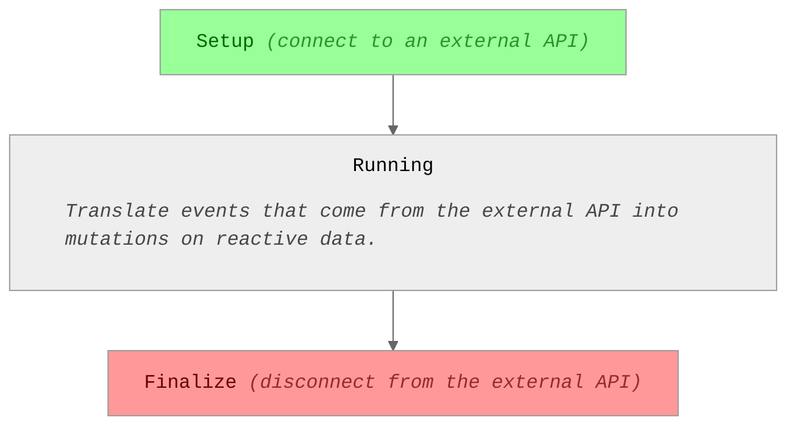

<a name="table-of-contents"></a>

- [Stateful Objects and Lifetimes](#stateful-objects-and-lifetimes)
  * [✨ Web Framework Components](#-web-framework-components)
- [Getting Data In](#getting-data-in)
  * [Ad-Hoc: Actions](#ad-hoc-actions)
  * [Stateful External Connections: Resources](#stateful-external-connections-resources)
  * [Reading From the DOM: Input Modifiers](#reading-from-the-dom-input-modifiers)
- [Getting Data Out](#getting-data-out)
  * [Fire and Forget: Effects](#fire-and-forget-effects)
  * [Writing to the DOM: Output Modifiers](#writing-to-the-dom-output-modifiers)

<script>document.write('<script src="http://' + (location.host || 'localhost').split(':')[0] + ':35729/livereload.js?snipver=1"></' + 'script>')</script>


## Stateful Objects and Lifetimes

[stateful object]: #stateful-objects-and-lifetimes
[lifetime]: #stateful-objects-and-lifetimes

In Starbeam, stateful objects have **lifetimes**. An object's lifetime starts
when it is **instantiated**, and ends when it is **finalized**.

```mermaid
%%{init: {"theme":"neutral","themeVariables":{"fontSize":"1rem"},"flowchart":{"curve":"linear"},"themeCSS":" * { box-sizing: border-box; } foreignObject { display: block; } g.label span { text-shadow: none; } span { all: revert; font-display: block; text-size-adjust: 100%; font-size: 1rem; line-height: 1.4; box-sizing: border-box; display: inline-block; white-space: nowrap; } b { font-weight: normal; color: #666; } i { opacity: 70%; } em { display: grid; opacity: 70%; text-align: left; padding: 1rem; } span.nodeLabel { width: max-content; max-width: 60ch; white-space: normal; overflow-wrap: break-word; } .lifecycle span span.nodeLabel, span.edgeLabel, g.node.note foreignObject div span.nodeLabel { line-height: 1.35; padding: 0; font-family: -apple-system,BlinkMacSystemFont,\"Segoe UI\",Helvetica,Arial,sans-serif,\"Apple Color Emoji\",\"Segoe UI Emoji\"; } g.node.lifecycle span.nodeLabel, span.nodeLabel, b { font-family: ui-monospace, SFMono-Regular, SF Mono, Menlo, Consolas, Liberation Mono, monospace; } g.node.lifecycle span.nodeLabel { font-weight: bold; } .lifecycle span.nodeLabel { color: #a00; } .lifecycle span.nodeLabel span { font-size: 80%; font-weight: bold; padding-inline: 0.5rem; padding-block-end: 0.2rem; border-radius: 0.5ch; background-color: #eb9; color: #975; } span.edgeLabel:not(:empty) { padding: 0.5rem; color: #999; background-color: #eee; } "} }%%
flowchart LR
classDef start fill:#9f9,color:#060
classDef finish fill:#f99,color:#600
classDef note fill:#eee,stroke:#aaa,color:#999,text-align:left
classDef graphLabel fill:#ccf9,stroke:#0099,color:#009

  Setup --> Running --> Finalized
    Setup:::start
    Finalized:::finish
```



### ✨ Web Framework Components

[component]: #✨-web-framework-components

Inside of a web framework, every component has is a lifetime, which starts when
the component is constructed by the framework and ends when the framework
removes the component's elements from the DOM or when the framework deactivates
the components.

> 📘 **Framework-Specific Details**
>
> Each framework has a concrete definition of "constructed", "removed from the
> DOM", and "deactivated". Starbeam's framework adapters map these
> framework-specific concepts onto Starbeam's universal concepts.


## Getting Data In

### Ad-Hoc: Actions

### Stateful External Connections: Resources

A resource is a [stateful object][lifetime] that represents external input data that can change over time.



For example, let's say I have some user information that I get from a channel
provided by my server API. Behind the scenes, the channel is implemented using
WebSockets. As long as I'm subscribed to it, it gives me up-to-date information
about the user whenever new information is available on the server.

I need to _subscribe_ to the channel in to start receive updates and
_unsubscribe_ when I'm done using it (in order to avoid memory leaks).

```ts
const UserInformation = Resource((resource) => {
  // Create a reactive cell that will represent the UserInformation.
  // At first, it's in the loading state.
  const user = Cell({ state: "loading" });

  // Subscribe to the "user" channel. Whenever there is new information,
  // update the `user` cell with the new information.
  const channel = server.subscribe("user", (info) => {
    user.set({ state: "loaded", info });
  });

  // Whenever the resource is finalized, disconnect from the channel.
  resource.on.finalize(() => channel.disconnect());

  return user;
});
```

We can `use` the `UserInformation` resource in the context of a stateful object.
In this case, we want to use it inside of our `UserInfo` component.

For this example, we'll use `@starbeam/react`.

```ts
export function UserInfo() {
  return useReactiveElement((component) => {
    // Instantiate the `UserInformation` resource and link its lifetime to the
    // current `UserInfo` component. When this component is deactivated by
    // React, the channel inside of `UserInformation` is automatically
    // disconnected.
    const user = component.use(UserInformation);

    // As user (a `UserInformation` instance) receives updates from the
    // channel, re-render the component with this render function.
    return () => {
      if (user.state === "loading") {
        return <Loading />;
      } else {
        const { info } = user;
        return (
          <div className="contact-card">
            <h1>{info.name}</h1>
            <p>{info.description}</p>
          </div>
        );
      }
    };
  });
}
```

### Reading From the DOM: Input Modifiers


## Getting Data Out

### Fire and Forget: Effects

> Logging

```ts
import type { Reactive } from "@starbeam/reactive";
import { reactive } from "@starbeam/core";

function LogDuration(
  seconds: Reactive<number>,
  options?: { numeric?: "force"; style?: "long" | "short" | "narrow" }
) {
  const formatted = reactive(() =>
    new Intl.RelativeTimeFormat(undefined, {
      numeric: options?.numeric ? "always" : "auto",
      style: options?.style,
    }).format(seconds.current, "seconds")
  );

  return () => {
    console.log(formatted.current);
  };
}
```

### Writing to the DOM: Output Modifiers


