<a name="table-of-contents"></a>

- [What is Reactive Data?](#what-is-reactive-data)
  * [Starbeam is Efficient!](#starbeam-is-efficient)
- [Two Fundamental Phases: Rendering and Action](#two-fundamental-phases-rendering-and-action)
  * [The Rendering Phase](#the-rendering-phase)
  * [The Action Phase](#the-action-phase)
  * [How To Think About It](#how-to-think-about-it)
- [Getting Data In: Actions](#getting-data-in-actions)
- [Internally Coherent](#internally-coherent)
- [Stateful Objects and Lifetimes](#stateful-objects-and-lifetimes)
  * [✨ Web Framework Components](#-web-framework-components)
- [Getting Data In](#getting-data-in)
  * [Ad-Hoc: Actions](#ad-hoc-actions)
  * [Stateful External Connections: Resources](#stateful-external-connections-resources)
  * [Reading From the DOM: Input Modifiers](#reading-from-the-dom-input-modifiers)
- [Getting Data Out](#getting-data-out)
  * [Fire and Forget: Effects](#fire-and-forget-effects)
  * [Writing to the DOM: Output Modifiers](#writing-to-the-dom-output-modifiers)


Starbeam is a **reactivity system** for **web applications** that is
**internally coherent** and provides a structured way of interacting with
external sources of data and affecting the external environment.

## What is Reactive Data?

You can think of Reactive data in Starbeam like cells in an Excel spreadsheet.

There are two kinds of cells in Starbeam:

- **Data**: An editable cell that you can update with new data
- **Formula**: A cell that _derives_ its value from other data or formula cells.

Let's take a quick look at the system in action.

```ts
import { formula, reactive } from "@starbeam/core";

//***********//
//** CELLS **//
//***********//

// create a cell whose value is an array of numbers ([1, 2, 3])
const numbers = reactive([1, 2, 3]);

//**************//
//** FORMULAS **//
//**************//

// create a formula that sums up the numbers by looping over them and adding
// them up.
const sum = formula(() => {
  let sum = 0;

  for (const number of numbers) {
    sum += number;
  }

  return sum;
});

// create a second formula that turns the array of numbers into a
// comma-separated string
const stringified = formula(() => numbers.join(","));

//**************//
//** LET'S GO **//
//**************//

// the current value of the `stringified` formula is 1,2,3
stringified.current; // 1,2,3

// and the current value of the `sum` formula is 6, which is the sum of 1, 2,
// and 3.
sum.current; // 6

// So far so good. Now let's use the push method on JavaScript Array to add a
// new number to the `numbers` list.
numbers.push(4);

// the current value of `stringified` is up to date with the new number
stringified.current; // 1,2,3,4
// the current value of `sum` is 10, which is the sum of 1, 2, 3 and the value
// we just added to the list: 4.
sum.current; // 10

// Next, we'll update the first element of the Array (index `0`) with the number
// 10. We're replacing the original `1` with `10`.
numbers[0] = 10;

// the curent value of the `stringified` formula is `"10,2,3,4"`, because the
// `1` in the original list was updated.
stringified.current; // 10,2,3,4
// and the value of the sum formula is `19`, which is the sum of our new
// numbers: 10, 2, 3, and 4.
sum.current; // 19
```

### Starbeam is Efficient!

You might be wondering: does Starbeam re-run the formulas every time we ask for
their value?

Nope, and this is part of what makes Starbeam's reactivity so amazing.

When you ask for the value of a formula, Starbeam automatically keeps track of
which data cells were used in the formula. If those data cells didn't change and
you ask for the value of the formula again, Starbeam returns the value it
computed last time.

<details>
  <summary>Code Example</summary>

```ts
import { formula, reactive } from "@starbeam/core";

//********** CELLS **********//

const person = reactive({
  name: "Chirag",
  company: "LinkedIn",
  project: "Starbeam",
});

//********* FORMULAS ********//

// The `personCard` formula creates a description of `person` by combining their
// name and company.
const personCard = formula(() => `${person.name} (${person.company})`);

// The `personProject` formula creates a description of `person` by combining
// their name and current project.
const personProject = formula(() => `${person.name} (${person.project})`);

//********* LET'S GO ********//

personCard.current; // "Chirag (LinkedIn)"

/**
 * At the moment, the `personCard` formula depends on two data cells:
 *
 * - `person`'s name
 * - `person`'s company
 */

personProject.current; // "Chirag (Starbeam)"

/**
 * At the moment, the `personProject` formula depends on two data cells:
 *
 * - `person`'s name
 * - `person`'s project
 */

person.project = "Starbeam Web";

// Because the `personCard` formula currently does *not* depend on `person`'s
// project property, Starbeam returns the value it computed last time.
personCard.current; // "Chirag (LinkedIn)"

// On the other hand, since the `personProject` formula currently *does* depend
// on `person`'s project property, Starbeam recomputes the value (and updates
// the formula's dependencies).
personProject.current; // "Chirag (Starbeam Web)"

person.name = "Chirag Patel";

// This time, because both the `personCard` and `personProject` formulas
// depended on `person`'s name property, they are not up to date, and Starbeam
// recomputes them.
personCard.current; // "Chirag Patel (LinkedIn)"
```

</details>


## Two Fundamental Phases: Rendering and Action

In Starbeam, data is synchronized with the DOM in the <ins>**Rendering**</ins> phase, and
updated in the <ins>**Action**</ins> phase.

These phases repeat for as long as your app is running.

```mermaid
%%{init: {"theme":"neutral","themeVariables":{"fontSize":"1rem"},"flowchart":{"curve":"linear"},"themeCSS":" * { box-sizing: border-box; } foreignObject { display: block; } g.label span { text-shadow: none; } span { all: revert; font-display: block; text-size-adjust: 100%; font-size: 1rem; line-height: 1.4; box-sizing: border-box; display: inline-block; white-space: nowrap; } b { font-weight: normal; color: #666; } i { opacity: 70%; } em { display: grid; opacity: 70%; text-align: left; padding: 1rem; } span.nodeLabel { width: max-content; max-width: 60ch; white-space: normal; overflow-wrap: break-word; } .lifecycle span span.nodeLabel, span.edgeLabel, g.node.note foreignObject div span.nodeLabel { line-height: 1.35; padding: 0; font-family: -apple-system,BlinkMacSystemFont,\"Segoe UI\",Helvetica,Arial,sans-serif,\"Apple Color Emoji\",\"Segoe UI Emoji\"; } g.node.lifecycle span.nodeLabel, span.nodeLabel, b { font-family: ui-monospace, SFMono-Regular, SF Mono, Menlo, Consolas, Liberation Mono, monospace; } g.node.lifecycle span.nodeLabel { font-weight: bold; } .lifecycle span.nodeLabel { color: #a00; } .lifecycle span.nodeLabel span { font-size: 80%; font-weight: bold; padding-inline: 0.5rem; padding-block-end: 0.2rem; border-radius: 0.5ch; background-color: #eb9; color: #975; } span.edgeLabel:not(:empty) { padding: 0.5rem; color: #999; background-color: #eee; } "} }%%
flowchart TD
classDef start fill:#9f9,color:#060
classDef finish fill:#f99,color:#600
classDef note fill:#eee,stroke:#aaa,color:#999,text-align:left
classDef graphLabel fill:#ccf9,stroke:#0099,color:#009
classDef next fill:#eef,stroke:#aac,color:#66c,font-weight:bold,font-size:90%

  Idle-->Action-->Rendering-->Idle
  Idle(["🔁 Idle"]):::note
  Action["Action<br><i>(update reactive data)</i>"]:::start
  Rendering["Rendering<br><i>(reactive data → DOM)</i>"]:::finish

```



### The Rendering Phase

In the _rendering_ phase, Starbeam reads from reactive cells and synchronizes
their values with the DOM.

During this phase, Starbeam will _read_ from reactive cells, but your code may
not _update_ data cells.

> 📘 Framework-Specific Details
>
> For example, when using Starbeam in a React app (using `@starbeam/react`):
> your components:
>
> - are regular component functions
> - use Starbeam-provided hooks
> - return normal JSX
>
> For an example of @starbeam/react, check out [the @starbeam/react docs][@starbeam/react].

[@starbeam/react]: TODO

### The Action Phase

In the _actions_ phase, you can freely read reactive cells and update reactive
data. As soon as you update reactive data, you can **immediately** check the
value of any formula in your reactive system and its computation will reflect
the change.

Whenever you update your reactive data in response to a browser callback, your
code is in the _Action_ phase. We call code running in the _Action_ phase an
<q>action</q>.

Actions may freely update reactive data and read from formulas in any order.
However, from the perspective actions, the **DOM** is frozen. Actions may read
from the DOM, but the DOM will only reflect changes actions make to data cells
in the next _Rendering_ phase.

Examples of Actions:

- Event Handlers for hardware events, such as click, keypress, input, etc.
- Code running in a `then` callback to a Promise
- Code running after an `await` in an `async function`
- Code running inside of the callback to `setTimeout`, `setInterval`,
  `requestAnimationFrame`, `requestIdleCallback` or `queueMicrotask`.
- ...

> 💡 Deeper Dive
>
> Basically, any code that runs in a browser [task] or [microtask] is running in
> the _Action_ phase. It is impossible for code that the browser scheduled as a
> [task] or [microtask] to run in the _Render_ phase.

[task]: TODO
[microtask]: TODO

%EXAMPLE: ./examples/quokka/simple-coherence.ts%

### How To Think About It

Almost all of the code you write will happen inside of the _Action_ phase.

## Getting Data In: Actions

In real life, we can't just enter all of the data in our reactive system in the console. We need to get data **in**.

In Starbeam,


## Internally Coherent

When we say that Starbeam is **internally coherent** ...

```ts
import { computed, reactive } from "@starbeam/core";

const person = reactive({
  name: "Tom Dale",
  username: "@tomdale",
  country: "United States",
});

const description = computed(
  () => `${person.name} (${person.username}) in ${person.country}`
);

description.current; //?
// Tom Dale (@tomdale) in United State

person.name = "Thomas Dale";

description.current; //?
// Thomas Dale (@tomdale) in United States

person.username = "@todale";
person.country = "Parts Unknown";

description.current; //?
// Thomas Dale (@todale) in Parts Unknown
```

```tsx
function Component() {
  const [x, setX] = useState(null);

  setX(new Person());

  return <div>{x.name()}</div>;
  // x is still 0
}

function StarbeamComponent() {
  return useReactiveElement(() => {
    const x = reactive(0);
    x.set(1);

    return () => <div>{x.current}</div>;
  });
}
```

Fetch vs. RemoteData

```ts
function fetch<T>(url: string, cell: Cell<T>): Effect {
  // const state = Cell({ state: "loading" });
  cell.set({ state: "loading" });

  return Effect(async (effect) => {
    try {
      const result = await fetch(url);
      const json = await result.json();

      effect.on.finalize(() => controller.abort());

      cell.set({ state: "loaded", data: json });
    } catch (e) {
      cell.set({ state: "error", reason: e });
    }
  });
}

function RemoteData(url, cell): Resource<JSON> {
  return Resource(async (resource) => {
    const cell = reactive({ state: "loading" });

    try {
      const result = await fetch(url);
      const json = await result.json();

      resource.on.finalize(() => controller.abort());

      cell.set({ state: "loaded", data: json });
    } catch (e) {
      cell.set({ state: "error", reason: e });
    }

    return cell;
  });
}
```

- action (code that runs outside of render)
- task
  - process that is attached to a stateful object, and is aborted when the stateful object is finalized
  - the callback is an action
- resource

  - is a task
  - the callback is an action, and the action is internal
  - exposes a readonly value (`T`) that can **always** be dereferenced (even during rendering)
  - since the resource doesn't expose its mutable reactive state, and the
    callbacks are actions by definition (they run outside of render), this
    pattern guarantees that the mutable reactive state can only be mutated in an
    action.
  - it's a reactive value with lifetime linking

  we need a name for "initialize" (the special action that sets up render, but
  doesn't actually render yet)


## Stateful Objects and Lifetimes

[stateful object]: #stateful-objects-and-lifetimes
[lifetime]: #stateful-objects-and-lifetimes

In Starbeam, stateful objects have **lifetimes**. An object's lifetime starts
when it is **instantiated**, and ends when it is **finalized**.


### ✨ Web Framework Components

[component]: #✨-web-framework-components

Inside of a web framework, every component has is a lifetime, which starts when
the component is constructed by the framework and ends when the framework
removes the component's elements from the DOM or when the framework deactivates
the components.

> 📘 **Framework-Specific Details**
>
> Each framework has a concrete definition of "constructed", "removed from the
> DOM", and "deactivated". Starbeam's framework adapters map these
> framework-specific concepts onto Starbeam's universal concepts.


## Getting Data In

### Ad-Hoc: Actions

### Stateful External Connections: Resources

A resource is a [stateful object][lifetime] that represents external input data
that can change over time.


For example, let's say I have some user information that I get from a channel
provided by my server API. Behind the scenes, the channel is implemented using
WebSockets. As long as I'm subscribed to it, it gives me up-to-date information
about the user whenever new information is available on the server.

I need to _subscribe_ to the channel in to start receive updates and
_unsubscribe_ when I'm done using it (in order to avoid memory leaks).

```ts
const UserInformation = Resource((resource) => {
  // Create a reactive cell that will represent the UserInformation.
  // At first, it's in the loading state.
  const user = Cell({ state: "loading" });

  // Subscribe to the "user" channel. Whenever there is new information,
  // update the `user` cell with the new information.
  const channel = server.subscribe("user", (info) => {
    user.set({ state: "loaded", info });
  });

  // Whenever the resource is finalized, disconnect from the channel.
  resource.on.finalize(() => channel.disconnect());

  return user;
});
```

We can `use` the `UserInformation` resource in the context of a stateful object.
In this case, we want to use it inside of our `UserInfo` component.

For this example, we'll use `@starbeam/react`.

```ts
export function UserInfo() {
  return useReactiveElement((component) => {
    // Instantiate the `UserInformation` resource and link its lifetime to the
    // current `UserInfo` component. When this component is deactivated by
    // React, the channel inside of `UserInformation` is automatically
    // disconnected.
    const user = component.use(UserInformation);

    // As user (a `UserInformation` instance) receives updates from the
    // channel, re-render the component with this render function.
    return () => {
      if (user.state === "loading") {
        return <Loading />;
      } else {
        const { info } = user;
        return (
          <div className="contact-card">
            <h1>{info.name}</h1>
            <p>{info.description}</p>
          </div>
        );
      }
    };
  });
}
```

### Reading From the DOM: Input Modifiers


## Getting Data Out

### Fire and Forget: Effects

> Logging

```ts
import type { Reactive } from "@starbeam/reactive";
import { reactive } from "@starbeam/core";

function LogDuration(
  seconds: Reactive<number>,
  options?: { numeric?: "force"; style?: "long" | "short" | "narrow" }
) {
  const formatted = reactive(() =>
    new Intl.RelativeTimeFormat(undefined, {
      numeric: options?.numeric ? "always" : "auto",
      style: options?.style,
    }).format(seconds.current, "seconds")
  );

  return () => {
    console.log(formatted.current);
  };
}
```

### Writing to the DOM: Output Modifiers


