<a name="table-of-contents"></a>

- [Unique Component Instances in React](#unique-component-instances-in-react)
- [The Catch](#the-catch)
- [The Solution](#the-solution)
- [Lifecycle](#lifecycle)

## Unique Component Instances in React

When you render a component in React, it gets a unique "rendered component
instance". If the component function contains any calls to `useState`,
`useRef`, etc. they will be associated with that unique instance.

Consider this example:

```ts
function Counter() {
  const [count, setCount] = useState(0);

  return (
    <>
      <button onClick={setCount((count) => count + 1)}>++</button>
      <p>{count}</p>
    </>
  );
}
```

When React render the Counter component for the first time, the component
calls `useState(0)`. React creates a fresh place to store state **for this
rendered component instance** and stores `0` in it.

The call to `useState(0)` returns the number `0` as well as a function that
you can use to update the counter value.

Whenever React runs the Counter function a second time **for the same
component instance**, the call to `useState` links back up to the same
storage location, and React returns the current value stored in that
location, as well as the setter function.

When you use the setter returned by `useState` to increment the value, React
changes the value in the storage location (in this case to `1`). Since a
storage location **associated with this component instance** changed, React
knows it needs to re-render the `Counter` component, and it schedules an
update.

The next time React renders the component, the call to `useState` will link
back up to the storage location, and voila, the return value will be `[1, setter]`.

## The Catch

This all works great, with a small catch.

As of React 18, React may run a component's cleanup functions (the return
values of `useEffect` and `useLayoutEffect`) and _then_ run its setup
functions (the callbacks in `useEffect` and `useLayoutEffect`) _again_.

> This currently happens when using [Fast Refresh] and is enforced via React
> 18 strict mode. The React team has said that it may run setup functions
> after cleanup for other reasons in the future. For now, support for strict
> mode is a good enough reason to care.

This means that a "component instance" may persist across cleanup.
**Importantly**, this means that your setup code is not allowed to assume
that it runs **after** the top-level of your component function, but
**before** cleanup.

> TODO: Add an example

This is all rather hard to get right.

## The Solution

The `useResource` hook gives you a way to create a new instance of something
when the component is first instantiated, clean it up when the component is
deactivated, and create a brand **new** instance when the component is
reactivated.

TL;DR It works almost the same way that per-component state in React works,
but gives you a fresh copy whenever React re-attaches the component.

In practice, this means that you can treat React's behavior as a pooling
optimization, rather than as a detail that your component needs to think
about.

## Lifecycle

```mermaid
%%{init: {
  "theme": "neutral",
  "themeVariables": { 'fontSize': '1rem' },
  "flowchart" : { "curve" : "linear" },
  "themeCSS": "* { box-sizing: border-box } foreignObject {  display: block; } span {  all:revert; font-display: block;  text-size-adjust: 100%; font-size: 1rem; line-height: 1.4;   box-sizing: border-box; display: inline-block; white-space: nowrap; } b { font-weight: normal; color: #666; } span.nodeLabel { width: max-content; max-width:60ch; white-space:normal; overflow-wrap: break-word;  } .lifecycle span span.nodeLabel, span.edgeLabel, g.node.note foreignObject div span.nodeLabel { line-height: 1.35;  padding:0; font-family: -apple-system,BlinkMacSystemFont,\"Segoe UI\",Helvetica,Arial,sans-serif,\"Apple Color Emoji\",\"Segoe UI Emoji\";  } g.node.lifecycle span.nodeLabel, span.nodeLabel, b { font-family: ui-monospace,SFMono-Regular,SF Mono,Menlo,Consolas,Liberation Mono,monospace } g.node.lifecycle span.nodeLabel { font-weight: bold; }  .lifecycle span.nodeLabel { color: #a00 }  .lifecycle span.nodeLabel span { font-size: 80%; font-weight: bold; padding-inline: 0.5rem; padding-block-end: 0.2rem; border-radius: 0.5ch; background-color: #eb9; color: #975; } span.edgeLabel:not(:empty) { padding: 0.5rem; color: #999; background-color: #eee }"
}}%%


flowchart TB
    classDef lifecycle fill:#fca,stroke:#975
    classDef next fill:#eef,stroke:#aac,color:#66c,font-weight:bold,font-size:90%
    classDef start fill:#eef,stroke:#aac,color:#66c,font-weight:bold,font-size:90%
    classDef single fill:#ccf,stroke:#88c,color:#55c
    classDef state fill:#dfd,stroke:#4b4,color:#494
    classDef terminal fill:#fcc,stroke:#c88,color:#c55
    classDef react fill:#99f,stroke:#339,color:#009
    classDef async fill:#eee,stroke:#999,color:#999
    classDef graphLabel fill:#ccf9,stroke:#0099,color:#009
    classDef note fill:#eee,stroke:#aaa,color:#999,text-align:left

    style RenderingBody fill:#0000,stroke:#0000
    style IdleBody fill:#0000,stroke:#0000
    style DeactivateBody fill:#0000,stroke:#0000


    %%%%%%%%%%%%%%%%%%%%%%%%%%%
    %% Rendering a Component %%
    %%%%%%%%%%%%%%%%%%%%%%%%%%%

    Render-->ReactInvokes-->InsertedState--->ActivateGroup
      ReactInvokes[["<span>lifecycle</span> create()"]]:::lifecycle
      InsertedState["🖥️ in DOM"]:::state
      Render:::start

    ActivateGroup--->IdleGroup--->DeactivateGroup

    %%%%%%%%%%%%%%%
    %% Rendering %%
    %%%%%%%%%%%%%%%

    subgraph ActivateGroup [ ]
      direction LR
      subgraph RenderingBody [ ]
      direction TB
      AppendedState-->|"on initial render"|AttachedHook
      AppendedState-->|"on rerender"|UpdateHook
      AttachedHook-->PaintedState
      UpdateHook-->PaintedState
      PaintedState-->|"⚛ React schedules"|ReadyHook
      ReadyHook-->NextIdle
        AppendedState([activate]):::graphLabel
        AttachedHook[["<span>lifecycle</span> attached()"]]:::lifecycle
        UpdateHook[["<span>lifecycle</span> update()"]]:::lifecycle
        ReadyHook[["<span>lifecycle</span> ready()"]]:::lifecycle

        PaintedState["🖥️ painted"]:::state
        NextIdle[["⬇️ idle"]]:::next
      end

      ActivateDescription(<b>activate</b> takes a component whose elements are in the DOM and takes it through the activation steps. This happens both on initial render and on rerender.):::note
    end


    %%%%%%%%%%%%%%
    %% Updating %%
    %%%%%%%%%%%%%%

    subgraph IdleGroup [ ]
      direction LR
      subgraph IdleBody [ ]
        WaitingState--->|"⚛️ component deactivated"|NextDeactivated
        WaitingState--->|"⚛️ rerender component"|NextUpdating
          WaitingState(["⏸ ️idle"]):::paused
          NextUpdating[["⤴️ activate"]]:::next
          NextDeactivated[["⬇️ deactivate"]]:::next
      end

      IdleDescription("Once a component has been <b>activated</b>, it spends most of its (wall clock) time waiting for something to do: either re-render (<b>activate</b> again) or <b>deactivate</b>."):::note
    end

    subgraph DeactivateGroup [ ]
      direction LR
      subgraph DeactivateBody [ ]
        DeactivatedState-->DeactivateHook
        DeactivateHook-->IdleDeactivatedState
        IdleDeactivatedState--->|"⚛️ unmount component"|NextRemoved
        IdleDeactivatedState--->|"⚛️ remount component"|NextReactivate
          DeactivatedState(["deactivated"]):::graphLabel
          IdleDeactivatedState["⚛️ deactivated"]:::state
          DeactivateHook[["<span>lifecycle</span> deactivate()"]]:::lifecycle
          NextRemoved[[removed]]:::terminal
          NextReactivate[["⤴️ activate"]]:::next
      end

      DeactivateDescription("As of React 18, a component's <i>deactivation</i> is not synonymous with <i>unmounting</i>. When <b>deactivated</b>, a component can be <b>removed</b> later (like in React 17), or <b>remounted</b>.<br><br>As of React 18, React deactivates and reactivates components on every render in <b>Strict Mode</b>. This behavior also occurs when doing Hot Module Reloading."):::note
    end
```

<p>Hi</p>



[fast refresh]: https://www.npmjs.com/package/react-refresh
